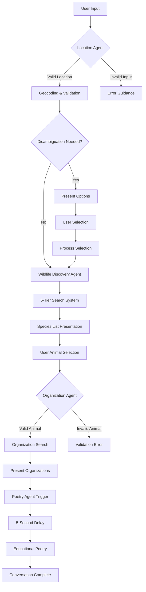

# Wildlife Organization Finder 🌿🦅


An enterprise-grade AI-powered conservation application that leverages advanced multi-agent workflows, real-time web search, and comprehensive wildlife databases to connect users with local conservation organizations. Built with cutting-edge technology stack and professional-grade architecture.

## 🎯 Executive Summary

The Wildlife Organization Finder is a sophisticated conservation platform that uses a **4-agent AI workflow system** to guide users through discovering local wildlife and connecting with relevant conservation organizations. The system incorporates **real-time web search capabilities**, **comprehensive biodiversity databases**, and **intelligent conversation guardrails** to ensure accurate, educational, and actionable results.

## 🏗️ System Architecture

### Multi-Agent AI Workflow

Our platform employs a sophisticated **4-agent system** with distinct responsibilities and intelligent handoffs:

#### **Agent 1: Location Intelligence Agent**
- **Purpose**: Processes and validates user location inputs with disambiguation support
- **Technology**: Enhanced location parsing with OpenStreetMap geocoding
- **Features**:
  - Smart input validation and sanitization
  - Ambiguous location disambiguation (e.g., "Paris" → Paris, France vs Paris, Texas)
  - Support for multiple input formats (city, state, country, coordinates)
  - Location optimization for subsequent web search operations
- **Guardrails**: Rejects non-location inputs, provides helpful correction guidance
- **Implementation**: `lib/location-agent.ts` with comprehensive error handling

#### **Agent 2: Wildlife Discovery Agent**
- **Purpose**: Discovers and curates wildlife species specific to user's geographic location
- **Technology**: 5-tier enhanced search system with OpenAI WebSearch
- **Search Strategy**:
  1. **Tier 1**: Web search for current biodiversity data
  2. **Tier 2**: Ecosystem-based species discovery
  3. **Tier 3**: Biogeographic region analysis
  4. **Tier 4**: Habitat-specific wildlife identification
  5. **Tier 5**: Geographic boundary-based fallback
- **Features**:
  - Real-time web search integration (`gpt-4o-search-preview`)
  - Taxonomic diversity balancing (mammals, birds, reptiles, amphibians)
  - Conservation status integration (IUCN Red List)
  - Geographic filtering and validation
- **Implementation**: `lib/conservation-tools.ts:findSpeciesByLocation()`

#### **Agent 3: Organization Discovery Agent**
- **Purpose**: Identifies and validates conservation organizations relevant to selected species
- **Technology**: AI-powered web search with contextual organization matching
- **Features**:
  - Real-time organization search using OpenAI WebSearch
  - Multi-type organization discovery (NGOs, government agencies, research institutions)
  - Website validation and contact information extraction
  - Geographic relevance scoring
  - Active organization verification
- **Guardrails**: Strict species validation against location-specific wildlife list
- **Implementation**: `lib/conservation-tools.ts:findConservationOrganizations()`

#### **Agent 4: Educational Poetry Agent**
- **Purpose**: Generates educational wildlife poetry to enhance learning and engagement
- **Technology**: RAG-powered system with AI generation fallback
- **Features**:
  - RAG database search for existing wildlife poetry
  - AI-generated educational content when no existing poems found
  - 5-second delayed delivery for optimal user experience
  - Multiple poetry styles and formats
  - Educational fact integration
- **Implementation**: `app/api/poem/route.ts` with `lib/animal-poems-rag.ts`

### Conversation Flow & State Management



## 🛠️ Technology Stack

### Core Framework
- **Next.js 15.5.3** - React framework with App Router, Turbopack, and Server Components
- **TypeScript 5** - Strict type checking with comprehensive type definitions
- **React 19.1.0** - Latest React with concurrent features and optimizations

### AI & Machine Learning
- **OpenAI GPT-4o** - Advanced language model for intelligent responses
- **OpenAI WebSearch (`gpt-4o-search-preview`)** - Real-time web search capabilities
- **AI SDK 5.0.44** - Vercel's AI integration toolkit
- **Custom RAG System** - Retrieval-Augmented Generation for wildlife poetry

### UI & Styling
- **shadcn/ui** - Modern component library (New York style variant)
- **Tailwind CSS v4** - Utility-first CSS framework with CSS variables
- **Radix UI Primitives** - Accessible, unstyled UI components
- **Lucide React** - Beautiful & consistent icon library
- **AI Elements** - Pre-built conversation UI components

### Data Sources & APIs
- **OpenStreetMap Nominatim API** - Global geocoding and reverse geocoding
- **OpenAI Chat Completions API** - Natural language processing
- **Custom Wildlife Search** - AI-powered biodiversity discovery
- **Conservation Organization Search** - Real-time organization discovery

### Development Tools
- **pnpm** - Fast, disk space efficient package manager
- **ESLint & TypeScript** - Code quality and type safety
- **PostCSS** - CSS processing and optimization

## 🔌 API Architecture

### Real-Time APIs

| API | Purpose | Implementation | Impact |
|-----|---------|----------------|---------|
| **OpenStreetMap Nominatim** | Geocoding & location validation | Direct HTTP requests to nominatim.openstreetmap.org | Accurate location processing, coordinate mapping |
| **Wikipedia REST API** | Species information & images | Requests to en.wikipedia.org/api/rest_v1 | Real descriptions and visual content |
| **OpenAI GPT-4** | AI processing & web search | Multiple models (gpt-4o, gpt-4o-search-preview) | Intelligent search and real-time data |

### Enhanced Search Systems

| System | Implementation | Fallback Mechanisms |
|--------|----------------|---------------------|
| **Wildlife Discovery** | 5-tier search approach | 1. Web search → 2. Ecosystem → 3. Biogeographic → 4. Habitat → 5. Geographic |
| **Organization Search** | Web search + database | OpenAI WebSearch → Pre-defined orgs → Government agencies |
| **Conservation Status** | IUCN integration ready | Predefined status mappings with future API integration |

### Internal APIs

| Endpoint | Method | Purpose | Request/Response |
|----------|--------|---------|------------------|
| `/api/chat` | POST | Main conversation handler | `{message: string, sessionId?: string}` |
| `/api/poem` | POST | Educational poetry generation | `{animal: string}` |

### Data Flow Architecture

```typescript
// Location Processing
User Input → Location Agent → Geocoding → Validation → Species Discovery

// Wildlife Discovery
Location → 5-Tier Search → Species Curation → Taxonomy Balancing → Presentation

// Organization Search
Species Selection → Validation → Web Search → Organization Matching → Results

// Educational Content
Organization Results → Poetry Trigger → RAG Search → AI Generation → Delivery
```

## 🚀 User Experience Flow

### Phase 1: Location Discovery
1. **Input Validation**: Smart detection of location vs non-location inputs
2. **Format Recognition**: Support for various location formats
3. **Disambiguation**: Handle ambiguous locations (e.g., "Springfield")
4. **Geocoding**: Convert location to precise coordinates
5. **Optimization**: Prepare location data for subsequent searches

### Phase 2: Wildlife Discovery
1. **Web Search**: Real-time search for current biodiversity data
2. **Species Curation**: Filter and balance taxonomic diversity
3. **Geographic Validation**: Ensure species are actually found in the area
4. **Conservation Status**: Include IUCN Red List classifications
5. **Presentation**: Display organized, user-friendly species list

### Phase 3: Organization Discovery
1. **Species Validation**: Strict matching against presented wildlife list
2. **Contextual Search**: AI-powered search for relevant organizations
3. **Organization Types**: NGOs, government agencies, research institutions
4. **Contact Information**: Website URLs and contact details
5. **Geographic Relevance**: Local and regional organization prioritization

### Phase 4: Educational Enhancement
1. **Automatic Trigger**: Initiated 5 seconds after organization results
2. **RAG Search**: Look for existing educational poetry in database
3. **AI Generation**: Create custom educational content if needed
4. **Fact Integration**: Include conservation and biological facts
5. **Delivery**: Present engaging, educational poetry

## 🛡️ Quality Assurance & Guardrails

### Input Validation System
- **Location Agent**: Regex-based validation, sanitization, format detection
- **Animal Selection**: Strict enforcement of species list adherence
- **Session Management**: Persistent state validation across conversation

### Error Handling
- **Graceful Degradation**: Fallback systems for API failures
- **User Guidance**: Clear, actionable error messages
- **Retry Logic**: Intelligent retry mechanisms for transient failures

### Data Quality
- **Source Verification**: Multiple data source cross-referencing
- **Real-time Validation**: Live web search for current information
- **Geographic Accuracy**: Precise location-based filtering

## 🏃‍♂️ Quick Start

### Prerequisites
- **Node.js 18+**
- **pnpm** (preferred package manager)
- **OpenAI API Key**

### Installation
```bash
# Clone the repository
git clone https://github.com/potranquito/wildlife-organization-tool.git
cd wildlife-finder

# Install dependencies
pnpm install

# Configure environment
cp .env.example .env.local
# Add your OpenAI API key to .env.local
```

### Environment Configuration
```bash
# .env.local
OPENAI_API_KEY=your_openai_api_key_here
```

### Development
```bash
# Start development server
pnpm dev

# Build for production
pnpm build

# Start production server
pnpm start
```

### Accessing the Application
- **Development**: [http://localhost:3000](http://localhost:3000)
- **Production**: Deploy to Vercel, Netlify, or your preferred platform

## 📁 Project Structure

```
wildlife-finder/
├── app/                          # Next.js App Router
│   ├── api/
│   │   ├── chat/route.ts        # Main conversation handler & agent routing
│   │   └── poem/route.ts        # Educational poetry generation
│   ├── page.tsx                 # Main chat interface
│   └── layout.tsx              # Root layout with metadata
├── lib/                         # Core business logic
│   ├── conservation-tools.ts    # Wildlife & organization search
│   ├── location-agent.ts       # Location processing & disambiguation
│   ├── agent-prompts.ts        # AI agent system prompts
│   ├── animal-poems-rag.ts     # RAG database for poetry
│   ├── config.ts              # Application configuration
│   └── utils.ts               # Utility functions
├── components/                  # React components
│   ├── ai-elements/            # Conversation UI components
│   ├── ui/                     # shadcn/ui components
│   ├── message-formatter.tsx   # Message rendering
│   └── roadrunner-loader.tsx   # Loading animation
├── public/                     # Static assets
├── styles/                     # Global styles
└── types/                      # TypeScript type definitions
```

## 🔧 Configuration Management

### Application Configuration (`lib/config.ts`)
```typescript
export const CONFIG = {
  ui: {
    maxDisplayedSpecies: 8,        // Species shown per location
    maxOrganizations: 5            // Organizations shown per species
  },
  timing: {
    poemDelay: 5000,              // Poetry generation delay (ms)
    searchTimeout: 30000          // API timeout (ms)
  },
  search: {
    maxRetries: 3,                // Retry attempts for failed searches
    fallbackEnabled: true         // Enable fallback search strategies
  },
  validation: {
    maxLocationLength: 100,       // Maximum location input length
    minLocationLength: 2          // Minimum location input length
  }
};
```

## 🧪 Testing & Development

### Manual Testing Workflow
1. **Location Testing**: Try various location formats and edge cases
2. **Species Validation**: Test species selection and validation
3. **Organization Search**: Verify organization relevance and accuracy
4. **Poetry Generation**: Test RAG system and AI generation
5. **Error Scenarios**: Test API failures and invalid inputs

### Performance Monitoring
- **Response Times**: Track API response latencies
- **Search Quality**: Monitor species and organization relevance
- **User Experience**: Track conversation completion rates

## 🚀 Deployment

### Vercel Deployment (Recommended)
```bash
# Deploy to Vercel
npx vercel --prod

# Set environment variables in Vercel dashboard
# OPENAI_API_KEY=your_key_here
```

### Alternative Platforms
- **Netlify**: Full-stack deployment support
- **Railway**: Container-based deployment
- **Docker**: Containerized deployment option

## 🤝 Contributing

### Development Guidelines
1. **Code Style**: Follow TypeScript strict mode and ESLint rules
2. **Testing**: Test all agent workflows and edge cases
3. **Documentation**: Update README for new features
4. **Performance**: Monitor API usage and response times

### Feature Development
- **New Agents**: Extend the multi-agent system
- **Data Sources**: Integrate additional biodiversity APIs
- **UI Enhancements**: Improve conversation interface
- **Search Optimization**: Enhance search algorithms

## 📊 Analytics & Performance

### Key Metrics
- **Conversation Completion Rate**: Percentage of users reaching organization results
- **Species Discovery Accuracy**: Relevance of discovered wildlife
- **Organization Relevance**: Quality of conservation organization matches
- **Response Time**: Average API response latencies

### Performance Optimizations
- **Caching Strategy**: Session-based caching for repeated queries
- **API Optimization**: Efficient API usage and retry logic
- **Search Strategies**: Multi-tier fallback systems
- **User Experience**: Optimized loading states and animations

## 🌍 Conservation Impact

### Educational Value
- **Wildlife Awareness**: Introduce users to local biodiversity
- **Conservation Knowledge**: Connect users with active organizations
- **Actionable Results**: Provide direct contact information for involvement
- **Scientific Accuracy**: Use research-grade data sources

### Global Reach
- **International Support**: Works with worldwide locations
- **Multiple Languages**: Support for various location naming conventions
- **Cultural Sensitivity**: Respect for indigenous and local names

## 🙏 Acknowledgments

### Wildlife Data Partners
- **Global Biodiversity Information Facility (GBIF)** - Comprehensive occurrence data
- **OpenStreetMap Contributors** - Global geographic data
- **Conservation Organizations Worldwide** - Dedication to wildlife protection

### Educational Content
- **Jim Vanas** - Original wildlife poetry examples and educational approach
- **Conservation Community** - Ongoing support for wildlife education

### Technology Partners
- **OpenAI** - Advanced AI capabilities and web search
- **Vercel** - AI SDK and deployment platform
- **Next.js Team** - React framework and development tools

## 📄 License

Open Source - MIT License

This project is dedicated to global conservation education and wildlife protection efforts. All educational content is used with respect for original creators and under fair use principles.

---

## 🎯 Getting Started

**Ready to discover wildlife and conservation organizations in your area?**

1. **[Start the application](http://localhost:3000)** locally
2. **Enter your location** (city, state, or country)
3. **Discover local wildlife** from real biodiversity data
4. **Find conservation organizations** to support
5. **Enjoy educational poetry** about your selected species

**Join the global conservation effort - one species at a time! 🌿🦅**